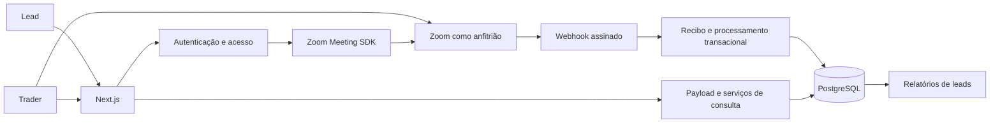

# Connect — estrutura e operação do backend

## 1. Arquitetura adotada

Manter um monólito modular: Next.js atende a interface e as rotas HTTP; Payload fornece autenticação, validação das coleções, API administrativa e acesso ao PostgreSQL. Essa estrutura é suficiente para o escopo atual, evita sincronização entre dois servidores e permite separar processamento assíncrono depois.



A versão do Next.js foi alinhada à linha 15.5 corrigida, com React estável e GraphQL 16 compatível com Payload. Conferir versões exatas no `package.json` e no lockfile. A atualização considera o [comunicado oficial de segurança de agosto de 2026](https://nextjs.org/blog/august-2026-security-release).

## 2. Organização dos arquivos

```text
src/
  app/
    (frontend)/                 páginas do produto e ação administrativa
    (payload)/                  integração do painel e REST API Payload
    api/
      auth/zoom/                início do OAuth e callback
      users/onboarding/         atualização permitida do cadastro
      zoom/signature/           autorização de entrada pelo SDK
      webhooks/zoom/            validação, recibo e transação de eventos
      meeting-logs/sync/         endpoint antigo desativado (410)
  collections/
    Users.ts                    identidade, papel e perfil do lead
    Meetings.ts                 reuniões cadastradas e estado observado
    MeetingLogs.ts              sessões de presença, incluindo admins
    ZoomEvents.ts               recibos únicos dos eventos processados
    MeetingTickets.ts           vínculo opaco do SDK com usuário/reunião
  lib/
    auth.ts                     autenticação comum e proteção administrativa
    access.ts                   trial, permissões e filtro comercial
    zoom-link.ts                validação dos links reais Zoom
    zoom-webhook.ts             regras de entrada, saída e ciclo da reunião
    reporting.ts                seleção por ocorrência e compatibilidade antiga
  migrations/                   esquema versionado PostgreSQL
  payload.config.ts             configuração e registro das coleções
  payload-types.ts               contratos gerados pelo Payload
public/zoom.html                 player que busca credenciais no servidor
scripts/create-admin.ts          bootstrap administrativo sem senha fixa
 tests/                         regras, processamento e migração sintéticos
```

As rotas controlam HTTP; as funções em `lib` concentram as regras reutilizadas. A API local do Payload ignora permissões por padrão: toda chamada iniciada por usuário deve autenticar e autorizar antes de usá-la. Não transportar consultas privilegiadas para rotas públicas sem essa verificação.

## 3. Modelo de dados

### `users`

- Identidade: `id`, `email`, `name`, `zoomId`, `avatar_url`.
- Autorização: `role = admin | user`.
- Trial: `createdAt` protegido por hook; fim calculado, sem campo editável pelo lead.
- Perfil: WhatsApp, experiência, profissão, disponibilidade, objetivos, dificuldades e expectativas.
- `onboardingCompleted` é atualizado pelo endpoint controlado.
- Papel e vínculo Zoom não podem ser modificados pelo lead na API gerada.
- Leitura e atualização: próprio usuário ou administrador; criação e exclusão administrativas, exceto criação interna no callback OAuth.

### `meetings`

- `title`, `date` em UTC, `zoomLink`, `zoomMeetingId`, `durationMinutes` planejada.
- `status = scheduled | live | ended`.
- `meetingUUID`, `startedAt`, `endedAt`: ocorrência observada no Zoom.
- `notifyParticipants`: campo reservado para compatibilidade; não entrega notificações.
- Escrita exclusivamente administrativa; leitura exige trial ativo ou administrador.
- `zoomLink` não é exposto a leads pela API gerada. A senha é recuperada no servidor para a entrada autorizada.

Cadastre uma linha por sessão agendada. Para números recorrentes, o evento procura primeiro o UUID; se ainda não estiver associado, escolhe o agendamento sem UUID mais próximo do início, em uma janela de 12 horas. Não vincula um evento desconhecido arbitrariamente a qualquer reunião.

### `meeting-logs`

- Relação `user` opcional: ausência de vínculo não impede auditoria.
- `participantName`, `participantEmail`, `zoomUserId` da conexão.
- `meetingId` do Zoom e `meetingUUID` da ocorrência.
- `sessionKey` único quando disponível.
- `joinTime`, `leaveTime`, `durationMinutes`, `webhookStatus`.
- `participantRole`: fotografia do papel no momento da associação.
- `source = zoom | browser`: browser apenas para registros legados.

Entrada e saída são instantes UTC; duração é diferença em minutos com quatro casas decimais, apresentada com duas nas telas. Não arredondar cada sessão para minutos inteiros. Uma sessão de 15 segundos representa 0,25 minuto.

### `zoom-events`

- `eventKey`: hash do tipo + payload do evento, índice único.
- `event`, `body`: recibo e conteúdo original.
- `createdAt`: instante de persistência.

O recibo é gravado na mesma transação da alteração de presença/estado. Logo, sua existência confirma que aquele processamento foi persistido. Falhas resultam em rollback e HTTP 500, permitindo nova entrega pelo Zoom. Eventos não suportados retornam sucesso com `ignored`.

Esta coleção não é ainda uma fila de notificações, nem registra tentativas que terminaram em rollback. Falhas são registradas no logger com a chave do evento, para correlação.

### `meeting-tickets`

- `key`: UUID aleatório de até 36 caracteres, enviado como `customerKey` ao SDK.
- `user`, `meetingId`, `expiresAt`.
- Criado apenas no servidor após validar acesso e reunião ao vivo.
- O webhook resolve o `customer_key` para identificar o usuário mesmo se o Zoom omitir e-mail.

Preservar os tickets durante a janela de auditoria/reentrega; eventos podem chegar depois da validade de entrada. O prazo do ticket documenta a validade da assinatura, não um prazo para descartar eventos legítimos atrasados. Os tickets não são credenciais de host.

## 4. Autenticação

Usar `payload.auth` em `lib/auth.ts` para todas as páginas e endpoints protegidos. O callback OAuth assina o cookie com `payload.secret`, que é o segredo processado do Payload. Usar diretamente o valor bruto de `PAYLOAD_SECRET` produziria tokens incompatíveis com os endpoints gerados. Referência: [JWT no Payload](https://payloadcms.com/docs/authentication/jwt).

O fluxo OAuth usa `state` aleatório em cookie HttpOnly, validade de 10 minutos e comparação em tempo constante. A sessão possui validade de 24 horas, SameSite Lax e Secure em produção. O token de acesso ao Zoom é usado para consultar o perfil e não é persistido.

A coleção usa JWT sem sessões persistentes (`useSessions: false`); logout remove o cookie, mas não revoga uma cópia do token antes de sua expiração. Uma evolução pode adotar sessões persistidas do Payload também no callback OAuth para revogação individual.

Credenciais OAuth, segredo do webhook, segredo do SDK e segredo Payload têm funções diferentes e devem ficar no servidor. O cliente recebe somente a autorização temporária de participante necessária ao SDK. A URL do iframe não contém assinatura, e-mail ou senha.

## 5. Contratos HTTP

| Método/rota | Entrada | Proteção e saída |
| --- | --- | --- |
| `GET /api/auth/zoom` | Nenhuma | Configuração OAuth; redirecionamento com estado |
| `GET /api/auth/zoom/callback` | `code`, `state` | Estado válido, consulta de perfil; cookie e redirecionamento |
| `POST /api/users/onboarding` | Campos explícitos do questionário | Usuário autenticado; atualiza somente o próprio perfil |
| `POST /api/zoom/signature` | `{ meetingNumber }` | Login, trial, onboarding e reunião ao vivo; assinatura com papel 0 |
| `POST /api/webhooks/zoom` | JSON oficial + cabeçalhos Zoom | HMAC + timestamp; transação idempotente |
| `POST /api/meeting-logs/sync` | Qualquer corpo | `410`: gravação pelo navegador desativada |
| API Payload `/api/users`, `/api/meetings`, etc. | Contratos das coleções | Controle de acesso por coleção e campo |
| Server Action `createMeetingAction` | Título, link e data ISO | Administrador; reunião real, sem notificações |

O campo `role` enviado a `/api/zoom/signature` é ignorado: clientes não podem elevar a autorização a host. O endpoint verifica a reunião cadastrada; não assina números arbitrários.

## 6. Webhook: sequência e consistência

1. Exigir `ZOOM_WEBHOOK_SECRET_TOKEN`.
2. Ler corpo bruto, `x-zm-request-timestamp` e `x-zm-signature`.
3. Rejeitar requisição sem assinatura, alterada ou com diferença de horário maior que cinco minutos.
4. Validar JSON e, quando aplicável, devolver a resposta criptográfica de `endpoint.url_validation`.
5. Validar os campos mínimos do evento, UUID, identidade da conexão e instantes.
6. Opcionalmente exigir a conta configurada em `ZOOM_ACCOUNT_ID`.
7. Calcular a chave e retornar sucesso se o recibo já existe.
8. Abrir transação PostgreSQL; gravar recibo único.
9. Processar o início/encerramento ou a sessão de presença.
10. Confirmar a transação; em falha, desfazer e permitir reentrega.

Para identificar usuários, priorizar ticket de entrada; depois `participant_user_id`/`id` permanente do Zoom; depois e-mail. Nunca usar `user_name` para identificação e nunca confundir o `user_id` transitório com o identificador da conta.

Reconexões preservam intervalos separados. A ordem inversa saída → entrada tenta reconciliar a primeira saída pendente posterior à entrada. Se o Zoom omitir entrada ou saída, registrar a lacuna e manter duração zero/pendente. Recuperar eventos perdidos com a API de relatórios Zoom é uma evolução; não inventar duração com base na data de criação do registro.

O fechamento da reunião não transforma automaticamente todos os logs abertos em tempo assistido. Isso evita atribuir ao lead a duração completa de uma reunião após uma desconexão cujo evento se perdeu.

A deduplicação de recibos é protegida por índice único. Conflitos concorrentes de sessões ou recibos causam rollback; o remetente pode repetir a entrega. Não há garantia de tratamento arbitrário de uma sequência incompleta de eventos além dos dados que o Zoom disponibiliza.

## 7. Relatórios e escala

Aplicar `isLeadLog` antes de toda agregação. O filtro exige usuário relacionado com papel `user`, exclui fotografia `admin` e exclui fonte browser/identificador legado `web-sdk-*`.

Consultar com `depth: 1` para que a relação do usuário traga o papel; um ID sem dados do usuário é excluído por segurança. Administradores continuam armazenados; filtrar somente na camada de consulta/indicadores.

Usar UUID para agrupar ocorrências. Logs legados sem UUID usam dia de Brasília, com a limitação documentada no projeto. Consultas atuais usam `pagination: false`, eliminando truncamento silencioso dos limites antigos de 100 leads ou 5.000 logs.

Para uma base grande, substituir carregamento integral por consultas agregadas SQL com filtro de papéis no banco, paginação dos detalhes, índices compostos `(meeting_uuid, zoom_user_id, join_time)` e `(user_id, join_time)`, além de cache invalidado por eventos. Preservar testes comparando resultados antes da otimização.

## 8. Migração e implantação

O projeto originalmente dependia da sincronização automática de esquema. A entrega inclui uma migração inicial que cria as tabelas em uma base nova e acrescenta os campos necessários às tabelas do protótipo sem apagar registros.

A migração também classifica registros antigos `web-sdk-*` como browser e preenche o papel de registros já vinculados. Não apaga duplicidades antigas automaticamente, pois não é possível afirmar quais registros são corretos sem recuperar as evidências.

Procedimento:

1. Criar backup da base existente e restaurá-lo em homologação.
2. Configurar `DATABASE_URI` para essa cópia e `PAYLOAD_DB_PUSH=false`.
3. Executar `npm run db:migrate`.
4. Conferir dados existentes, campos novos, índices únicos e relatórios.
5. Gerar tipos com `npm run generate:types` se houver mudanças adicionais nas coleções.
6. Executar testes, tipagem, lint e build.
7. Aplicar o mesmo procedimento no ambiente de destino durante a implantação.

O comando de migração não foi executado contra o banco do cliente nesta análise. O downgrade destrutivo da migração inicial foi desabilitado; restauração deve usar backup validado. Tabelas que tenham divergido do protótipo precisam de revisão do esquema antes da execução.

Não habilitar `PAYLOAD_DB_PUSH=true` em produção. A sincronização automática pode propor alterações incompatíveis com dados existentes. Usar novas migrações versionadas para futuras mudanças.

## 9. Testes e observabilidade

Comandos: `npm test`, `npm run typecheck`, `npm run lint`, `npm run build`.

Os testes exercitam o limite exato do trial, filtragem administrativa, assinatura/replay, intervalos curtos, domínio dos links, ocorrências recorrentes, reconexão, ordem invertida de eventos, identificação por ticket e preservação de estado encerrado. A migração pode ser validada em PostgreSQL embarcado descartável, sem acesso à base do cliente.

Para produção, acompanhar:

- Respostas 401/400/500 do webhook e eventos que continuam falhando nas reentregas.
- Reuniões que começaram no Zoom mas continuam `scheduled`.
- Sessões sem entrada ou sem saída confirmada.
- Participantes sem vínculo e tickets sem correspondência.
- Latência dos relatórios conforme o volume aumenta.

Não registrar tokens ou perfis OAuth completos no console. Restringir o painel técnico, definir backup/recuperação e uma política de retenção para eventos e presenças conforme as necessidades do cliente. Conservar auditoria suficiente para investigar divergências antes de eliminar tickets/eventos antigos.

## 10. Módulo de notificações — etapa futura

Implementação deliberadamente separada, conforme solicitado. Estrutura proposta:

```text
src/collections/Notifications.ts
src/collections/NotificationDeliveries.ts
src/collections/PushSubscriptions.ts
src/lib/notifications/enqueue.ts
src/lib/notifications/providers/in-app.ts
src/lib/notifications/providers/web-push.ts
src/lib/notifications/providers/whatsapp.ts
src/lib/notifications/providers/email.ts
src/jobs/deliver-notifications.ts
```

### Dados e idempotência

- `notifications`: reunião/UUID, usuário, título, mensagem, URL interna, data e leitura.
- `notification-deliveries`: notificação, canal, estado, tentativas, próxima tentativa, ID do provedor, erro resumido.
- `push-subscriptions`: usuário, endpoint e chaves de assinatura; leitura restrita.
- Chave única: `(meetingUUID, userId, channel, eventType)`.

### Processamento

1. Ao confirmar `meeting.started`, criar tarefas persistentes na mesma transação, em vez de chamar provedores no webhook.
2. Selecionar apenas leads ativos no instante do início. Antes de enviar, verificar se a reunião continua ao vivo e se o acesso permanece válido.
3. Um worker independente processa lotes com bloqueio, novas tentativas progressivas e limite de tentativas.
4. Aviso interno persiste mesmo quando o usuário está offline.
5. Web Push requer inscrição, permissão do navegador e service worker; um alerta enquanto a página está aberta não equivale a push com navegador fechado.
6. WhatsApp exige provedor, número remetente, configurações e modelos adequados ao canal.
7. E-mail exige provedor transacional, remetente e domínio configurados.
8. Confirmar envio/entrega pelos retornos e webhooks do provedor; não marcar sucesso apenas por enfileirar.
9. Registrar falhas isoladamente: um canal indisponível não impede reunião ou presença.

Critérios de aceite: nenhum admin/lead expirado recebe aviso; reenvio do início não duplica mensagens; falha de um provedor permite nova tentativa; preferências e cancelamento são respeitados; links voltam à autorização do Connect.

## 11. Evoluções adicionais possíveis

- Recuperação de eventos perdidos pela API de relatórios do Zoom.
- Reconciliação manual auditável de participantes sem identidade.
- Tempo cronológico único para acessos simultâneos em vários dispositivos.
- Revogação persistente de sessões OAuth.
- Criação de reuniões pelo servidor e início como host via SDK com ZAK, se desejados.
- Produtos, compras e acesso pago após trial.
- Filtros de período, exportações e métricas comerciais configuráveis.

Essas evoluções devem preservar a regra central: admins são registrados para auditoria e permanecem fora dos indicadores de leads.
