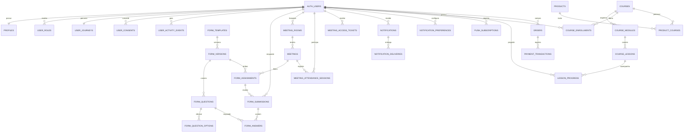

# Plano de estrutura de dados — Supabase

> Status: estrutura e importação aplicadas; Supabase é o backend exclusivo. Homologação de login/reunião Zoom ainda pendente. Consulte `docs/SUPABASE-IMPLEMENTACAO.md` para resultados e limites das fases futuras.
>
> Ajuste de implantação: o projeto informado já contém as tabelas Payload em `public`. O novo modelo usa `connect` para permitir a migração sem colisão.
>
> Base analisada: coleções atuais do Payload, fluxo de autenticação Zoom, reuniões/ocorrências, presença por webhook, onboarding, relatórios, produtos e requisitos da fase 2.

## 1. Objetivo

Substituir gradualmente as tabelas gerenciadas pelo Payload por um modelo PostgreSQL criado e versionado diretamente no Supabase, mantendo:

- login com Zoom;
- trial de 30 dias;
- onboarding obrigatório;
- reuniões agendadas, recorrentes e sala pessoal;
- presença confiável via webhook do Zoom;
- formulário/reflexão ao final de cada reunião;
- notificações internas agora e outros canais futuramente;
- estrutura pronta para cursos, progresso, produtos e pagamentos;
- segurança por usuário e por papel com Row Level Security (RLS).

O banco deve ser a fonte de verdade. Contadores como “lives assistidas”, “atividades respondidas” e “progresso” serão calculados a partir dos registros reais, evitando campos duplicados que possam ficar inconsistentes.

## 2. Decisões arquiteturais recomendadas

### 2.1 Autenticação e identidade

- Usar **Supabase Auth com o provedor Zoom** para os usuários da aplicação.
- Usar `auth.users.id` (`uuid`) como identidade principal.
- Criar `connect.profiles` em relação 1:1 com `auth.users`.
- Não copiar senha, hash, salt, token de recuperação ou sessão do Payload.
- Separar papel administrativo em `user_roles`, para impedir que o usuário altere o próprio papel ao editar seu perfil.
- Separar as credenciais Zoom usadas por hosts em `private.zoom_credentials`. O Supabase Auth autentica com Zoom, mas a aplicação continua responsável por armazenar/renovar de forma segura tokens usados depois para criar reuniões e obter ZAK.

### 2.2 Organização dos schemas

- `connect`: tabelas que a aplicação pode consultar pela Data API, sempre com RLS.
- `private`: credenciais, payload bruto de webhooks e estruturas exclusivamente server-side. Não expor esse schema na API.
- `auth`: gerenciado pelo Supabase; não alterar suas tabelas diretamente.
- `storage`: gerenciado pelo Supabase para avatares, capas, aulas e anexos.

### 2.3 Convenções

- Chaves primárias: `uuid`, com `gen_random_uuid()`, exceto tabelas gerenciadas pelo Supabase.
- Datas: `timestamptz`, armazenadas em UTC; apresentação em `America/Sao_Paulo`.
- Nomes: `snake_case`, no singular para enums e no plural para tabelas.
- Dinheiro: inteiro em centavos (`amount_cents bigint`) + moeda (`currency char(3)`).
- Campos flexíveis: `jsonb` apenas para metadados, payload externo e configurações; relações de negócio permanecem normalizadas.
- Toda tabela de negócio recebe `created_at` e `updated_at`; tabelas auditáveis não devem sofrer exclusão física pela aplicação.
- Arquivos guardam `bucket` + `object_path`, não uma URL pública permanente.

## 3. Visão geral dos relacionamentos



## 4. Tabelas — núcleo de usuários

### 4.1 `connect.profiles`

Dados públicos/operacionais do usuário, sem senha e sem credenciais externas.

| Coluna | Tipo | Regra |
| --- | --- | --- |
| `id` | `uuid` | PK e FK `auth.users(id) ON DELETE CASCADE` |
| `full_name` | `text` | obrigatório |
| `email` | `citext` | espelho para busca administrativa; único e normalizado |
| `whatsapp` | `text` | formato E.164 quando possível |
| `avatar_bucket` | `text` | opcional |
| `avatar_path` | `text` | opcional |
| `zoom_user_id` | `text` | único quando preenchido |
| `locale` | `text` | `pt-BR` ou `ht-HT`; padrão `pt-BR` |
| `timezone` | `text` | padrão `America/Sao_Paulo` |
| `is_blocked` | `boolean` | padrão `false`; somente gestor altera |
| `created_at` | `timestamptz` | definido no servidor |
| `updated_at` | `timestamptz` | atualizado por trigger |

O e-mail canônico permanece em `auth.users`. O espelho em `profiles` serve a telas e buscas, mas deve ser sincronizado por função controlada.

### 4.2 `connect.user_roles`

| Coluna | Tipo | Regra |
| --- | --- | --- |
| `user_id` | `uuid` | FK `profiles(id)` |
| `role` | `user_role` | `owner`, `admin`, `member` |
| `assigned_by` | `uuid` | FK para gestor, nulo no bootstrap |
| `created_at` | `timestamptz` | obrigatório |

PK composta: `(user_id, role)`. Criar índice único parcial que permita apenas um `owner`.

O papel técnico de acesso não deve representar a etapa comercial. Um usuário continua com papel `member` quando passa de lead para aluno; essa mudança fica em `user_journeys`.

### 4.3 `connect.user_journeys`

Estado comercial e período de acesso.

| Coluna | Tipo | Regra |
| --- | --- | --- |
| `user_id` | `uuid` | PK/FK `profiles(id)` |
| `status` | `journey_status` | ver enum abaixo |
| `trial_started_at` | `timestamptz` | imutável para o usuário |
| `trial_ends_at` | `timestamptz` | gravado explicitamente, não derivado de `created_at` |
| `onboarding_completed_at` | `timestamptz` | nulo até envio válido |
| `evaluation_requested_at` | `timestamptz` | opcional |
| `approved_at` | `timestamptz` | opcional |
| `student_since` | `timestamptz` | opcional |
| `last_seen_at` | `timestamptz` | atualizado de forma controlada |
| `status_changed_by` | `uuid` | gestor responsável, quando aplicável |
| `status_changed_at` | `timestamptz` | auditoria |
| `created_at` / `updated_at` | `timestamptz` | auditoria |

`journey_status`:

```text
trial | awaiting_evaluation | approved | needs_preparation |
not_continuing | active_student | inactive_student
```

Recomendação: manter também `user_journey_status_history` com `from_status`, `to_status`, `reason`, `changed_by` e `changed_at`, evitando perder o histórico quando o status mudar.

### 4.4 `connect.user_consents`

Registra aceite de termos, privacidade e comunicações conforme LGPD.

| Coluna | Tipo |
| --- | --- |
| `id` | `uuid` PK |
| `user_id` | `uuid` FK |
| `consent_type` | `terms`, `privacy`, `marketing_email`, `marketing_whatsapp`, `analytics` |
| `document_version` | `text` |
| `granted` | `boolean` |
| `occurred_at` | `timestamptz` |
| `source` | `text` |
| `ip_hash` | `text` opcional |

Não sobrescrever consentimentos antigos; inserir um novo evento quando houver concessão ou revogação.

### 4.5 `connect.admin_notes`

Observações privadas do painel administrativo.

| Coluna | Tipo |
| --- | --- |
| `id` | `uuid` PK |
| `user_id` | `uuid` FK do usuário observado |
| `author_id` | `uuid` FK do gestor |
| `body` | `text` |
| `created_at` / `updated_at` | `timestamptz` |

Somente `owner` e `admin` podem ler/escrever. O usuário observado nunca recebe acesso.

### 4.6 `connect.user_activity_events`

Eventos mínimos para métricas de uso.

| Coluna | Tipo |
| --- | --- |
| `id` | `uuid` PK |
| `user_id` | `uuid` FK |
| `event_type` | `login`, `page_view`, `meeting_join`, `form_submit`, `lesson_view` etc. |
| `occurred_at` | `timestamptz` |
| `entity_type` / `entity_id` | referência lógica opcional |
| `metadata` | `jsonb` limitado e sem segredos |

Índice principal: `(user_id, occurred_at DESC)`. Retenção e nível de detalhe devem ser definidos antes da produção.

### 4.7 `private.audit_logs`

Auditoria imutável para ações administrativas e operações sensíveis: `id`, `actor_user_id`, `action`, `entity_type`, `entity_id`, `before_data`, `after_data`, `request_id`, `occurred_at`. Os snapshots devem ser sanitizados para nunca copiar tokens, senhas ou dados de pagamento sensíveis. Consulta apenas por serviço ou rota administrativa controlada.

## 5. Tabelas — formulários de onboarding e pós-reunião

O mesmo motor atende onboarding, reflexão diária/pós-reunião, avaliação final e pesquisas futuras. Perguntas não ficam como colunas em `profiles`, pois isso dificulta versão, tradução e histórico.

### 5.1 `connect.form_templates`

| Coluna | Tipo |
| --- | --- |
| `id` | `uuid` PK |
| `slug` | `text` único, ex.: `initial-onboarding`, `post-meeting-reflection` |
| `kind` | `onboarding`, `post_meeting`, `evaluation`, `survey` |
| `name` | `text` |
| `description` | `text` |
| `is_active` | `boolean` |
| `created_by` | `uuid` gestor |
| `created_at` / `updated_at` | `timestamptz` |

### 5.2 `connect.form_versions`

| Coluna | Tipo | Regra |
| --- | --- | --- |
| `id` | `uuid` PK |  |
| `form_template_id` | `uuid` FK |  |
| `version` | `integer` | único por template |
| `title` / `description` | `jsonb` | traduções por locale |
| `status` | `draft`, `published`, `archived` | somente uma publicada por template |
| `published_at` | `timestamptz` | opcional |
| `created_by` | `uuid` | gestor |

Depois de publicada e respondida, uma versão não deve ser alterada. Nova mudança cria outra versão.

### 5.3 `connect.form_questions`

| Coluna | Tipo |
| --- | --- |
| `id` | `uuid` PK |
| `form_version_id` | `uuid` FK |
| `question_key` | `text` estável, ex.: `main_goal` |
| `label` / `help_text` | `jsonb` com traduções |
| `question_type` | `short_text`, `long_text`, `single_choice`, `multiple_choice`, `boolean`, `number`, `scale`, `date` |
| `is_required` | `boolean` |
| `position` | `integer` |
| `validation` | `jsonb` para limites e regras de interface |

Único: `(form_version_id, question_key)` e `(form_version_id, position)`.

### 5.4 `connect.form_question_options`

| Coluna | Tipo |
| --- | --- |
| `id` | `uuid` PK |
| `question_id` | `uuid` FK |
| `value` | `text` estável |
| `label` | `jsonb` traduzido |
| `position` | `integer` |

### 5.5 `connect.form_assignments`

Define qual versão deve ser respondida, por quem e em qual contexto.

| Coluna | Tipo | Uso |
| --- | --- | --- |
| `id` | `uuid` PK |  |
| `form_version_id` | `uuid` FK | versão congelada |
| `user_id` | `uuid` FK, nulo | nulo quando disponível a todo usuário elegível |
| `meeting_id` | `uuid` FK, nulo | preenchido no formulário pós-reunião |
| `opens_at` / `closes_at` | `timestamptz` | janela de resposta |
| `is_required` | `boolean` | onboarding `true`; reflexão pode ser `false` |
| `created_at` | `timestamptz` |  |

Para cada reunião encerrada, criar uma atribuição da versão publicada de `post_meeting`. Uma restrição única em `(meeting_id, form_version_id)` impede duplicação causada por reentrega do webhook.

### 5.6 `connect.form_submissions`

| Coluna | Tipo | Regra |
| --- | --- | --- |
| `id` | `uuid` PK |  |
| `assignment_id` | `uuid` FK |  |
| `user_id` | `uuid` FK | dono da resposta |
| `status` | `draft`, `submitted` |  |
| `started_at` | `timestamptz` |  |
| `submitted_at` | `timestamptz` | obrigatório ao finalizar |
| `created_at` / `updated_at` | `timestamptz` |  |

Único: `(assignment_id, user_id)`. Para onboarding, a conclusão de uma submissão válida atualiza `user_journeys.onboarding_completed_at` na mesma transação.

### 5.7 `connect.form_answers`

| Coluna | Tipo |
| --- | --- |
| `id` | `uuid` PK |
| `submission_id` | `uuid` FK |
| `question_id` | `uuid` FK |
| `value_text` | `text` |
| `value_number` | `numeric` |
| `value_boolean` | `boolean` |
| `value_date` | `date` |
| `value_json` | `jsonb`, principalmente múltipla escolha |
| `created_at` / `updated_at` | `timestamptz` |

Único: `(submission_id, question_id)`. Uma constraint deve exigir exatamente um campo `value_*` preenchido. O servidor valida o tipo contra `form_questions.question_type` antes de aceitar a submissão final.

### 5.8 Perguntas iniciais a migrar

Onboarding:

1. Opera no mercado financeiro?
2. Há quanto tempo conhece trading?
3. Já fez algum curso?
4. Profissão atual.
5. Tempo disponível por dia/semana.
6. Objetivo principal.
7. Profissão ou renda complementar.
8. Maior dificuldade.
9. Expectativa para os 30 dias.

Pós-reunião/reflexão diária:

1. O que você aprendeu hoje?
2. Você teria entrado nessa operação? Por quê?
3. O que faria diferente?
4. Qual foi o principal aprendizado?
5. Se não houve operação, por que foi correto não operar?
6. Observações pessoais.

O WhatsApp pertence a `profiles`, não às respostas do formulário.

## 6. Tabelas — reuniões e presença

O modelo novo separa a **sala Zoom reutilizável** da **ocorrência real da reunião**. Isso elimina a mistura atual entre `personal`, `recurring` e `occurrence` na mesma tabela.

### 6.1 `connect.meeting_rooms`

Configuração da sala no Zoom.

| Coluna | Tipo |
| --- | --- |
| `id` | `uuid` PK |
| `host_user_id` | `uuid` FK |
| `provider` | `zoom` inicialmente |
| `external_meeting_id` | `text` |
| `room_type` | `scheduled`, `recurring`, `personal` |
| `title` | `text` |
| `duration_minutes` | `integer` |
| `is_active` | `boolean` |
| `created_at` / `updated_at` | `timestamptz` |

Único: `(provider, external_meeting_id)`. URL de entrada e senha ficam em `private.meeting_room_secrets(room_id, join_url_encrypted, passcode_encrypted, updated_at)`, nunca nesta tabela pública. O servidor autoriza a entrada e devolve somente o necessário para aquela sessão.

### 6.2 `connect.meetings`

Uma linha por agendamento/ocorrência de negócio.

| Coluna | Tipo |
| --- | --- |
| `id` | `uuid` PK |
| `room_id` | `uuid` FK |
| `title` | `text` |
| `status` | `scheduled`, `live`, `ended`, `cancelled` |
| `external_uuid` | `text` único quando conhecido |
| `scheduled_starts_at` | `timestamptz` opcional para sala permanente |
| `actual_started_at` / `actual_ended_at` | `timestamptz` |
| `planned_duration_minutes` | `integer` |
| `notification_enabled` | `boolean` |
| `created_by` | `uuid` gestor |
| `created_at` / `updated_at` | `timestamptz` |

Índices: `(status, scheduled_starts_at)`, `(room_id, actual_started_at DESC)` e único parcial para `external_uuid` não nulo.

### 6.3 `connect.meeting_attendance_sessions`

Cada entrada/reentrada é uma sessão separada.

| Coluna | Tipo |
| --- | --- |
| `id` | `uuid` PK |
| `meeting_id` | `uuid` FK |
| `user_id` | `uuid` FK opcional; permite auditoria de desconhecido |
| `session_key` | `text` único |
| `provider_participant_id` | `text` |
| `participant_name` / `participant_email` | `text` auditável |
| `participant_role_snapshot` | `owner`, `admin`, `member`, `unknown` |
| `joined_at` / `left_at` | `timestamptz` |
| `duration_seconds` | `numeric(16,4)` calculado; nulo enquanto incompleto |
| `status` | `joined`, `left`, `incomplete` |
| `source` | `zoom_webhook`, `reconciliation`, `legacy` |
| `created_at` / `updated_at` | `timestamptz` |

Usar segundos decimais preserva também frações dos registros históricos. Não inventar saída quando o webhook estiver ausente. Índices: `(user_id, joined_at DESC)`, `(meeting_id, user_id)` e `(meeting_id, provider_participant_id, joined_at)`.

### 6.4 `connect.meeting_access_tickets`

| Coluna | Tipo |
| --- | --- |
| `id` | `uuid` PK e chave opaca enviada como `customer_key` |
| `user_id` | `uuid` FK |
| `meeting_id` | `uuid` FK |
| `expires_at` | `timestamptz` |
| `consumed_at` | `timestamptz` opcional |
| `created_at` | `timestamptz` |

Preservar pelo período de auditoria mesmo após expirar.

### 6.5 `private.integration_events`

Substitui `zoom_events` e aceita outros provedores futuramente.

| Coluna | Tipo |
| --- | --- |
| `id` | `uuid` PK |
| `provider` | `zoom` |
| `event_key` | `text` para idempotência |
| `event_type` | `text` |
| `external_entity_id` | `text` |
| `payload` | `jsonb` |
| `processing_status` | `received`, `processed`, `ignored`, `failed` |
| `error_code` | `text` opcional |
| `received_at` / `processed_at` | `timestamptz` |

Único: `(provider, event_key)`. O recibo e a alteração da reunião/presença devem ser confirmados na mesma transação.

### 6.6 `private.zoom_credentials`

| Coluna | Tipo |
| --- | --- |
| `user_id` | `uuid` PK/FK de owner/admin |
| `access_token_encrypted` | `text` |
| `refresh_token_encrypted` | `text` |
| `expires_at` | `timestamptz` |
| `scopes` | `text[]` |
| `updated_at` | `timestamptz` |

Nunca retornar esses campos ao navegador, nunca registrar tokens em logs e nunca armazená-los em `profiles` ou em metadados do Auth.

## 7. Tabelas — notificações

Separar a notificação que o usuário vê do estado de entrega de cada canal.

### 7.1 `connect.notification_templates`

`id`, `event_type`, `channel`, `locale`, `title_template`, `body_template`, `is_active`, timestamps. Apenas gestores editam.

### 7.2 `connect.notifications`

| Coluna | Tipo |
| --- | --- |
| `id` | `uuid` PK |
| `user_id` | `uuid` FK |
| `event_type` | ex.: `meeting_started`, `trial_ending`, `form_available` |
| `title` / `body` | `text` já renderizado |
| `action_url` | `text` interno |
| `entity_type` / `entity_id` | contexto opcional |
| `deduplication_key` | `text` único |
| `read_at` | `timestamptz` opcional |
| `created_at` / `expires_at` | `timestamptz` |

O usuário só lê e marca como lidas as próprias notificações. Criação é server-side.

### 7.3 `connect.notification_deliveries`

| Coluna | Tipo |
| --- | --- |
| `id` | `uuid` PK |
| `notification_id` | `uuid` FK |
| `channel` | `in_app`, `web_push`, `email`, `whatsapp` |
| `status` | `pending`, `processing`, `sent`, `delivered`, `failed`, `cancelled` |
| `attempt_count` | `integer` |
| `next_attempt_at` | `timestamptz` |
| `provider_message_id` | `text` |
| `last_error_code` / `last_error_message` | `text` sanitizado |
| `sent_at` / `delivered_at` | `timestamptz` |
| `created_at` / `updated_at` | `timestamptz` |

Único: `(notification_id, channel)`. E-mail/WhatsApp/Web Push entram em fase posterior; o desenho já suporta fila e retentativa.

### 7.4 `connect.notification_preferences`

PK `(user_id, channel, event_type)`, com `enabled`, `quiet_hours_start`, `quiet_hours_end` e timestamps. Consentimento legal e preferência operacional continuam separados.

### 7.5 `connect.push_subscriptions`

`id`, `user_id`, `endpoint_hash`, `endpoint_encrypted`, chaves criptografadas, `user_agent`, `last_used_at`, `revoked_at`, timestamps. Leitura e escrita devem passar por endpoint server-side.

### 7.6 Processamento recomendado

1. `meeting.ended` finaliza a ocorrência e cria a atribuição do formulário pós-reunião.
2. `meeting.started`, fim do trial e novos formulários geram eventos/notificações idempotentes.
3. Notificação interna é persistida imediatamente.
4. Entregas externas vão para uma fila durável; o worker confere preferência, consentimento e elegibilidade antes do envio.
5. Falha de WhatsApp/e-mail nunca desfaz reunião, presença ou resposta.

## 8. Tabelas — cursos e progresso (fase futura)

### 8.1 `connect.courses`

`id`, `slug` único, `title`, `description`, capa no Storage, `status` (`draft`, `published`, `archived`), `published_at`, timestamps.

### 8.2 `connect.course_modules`

`id`, `course_id`, `title`, `description`, `position`, `release_rule` (`immediate`, `days_after_enrollment`, `previous_module`), `release_after_days`, timestamps.

Único: `(course_id, position)`.

### 8.3 `connect.course_lessons`

`id`, `module_id`, `title`, `description`, `content_type` (`video`, `text`, `live`, `download`), `content_path`/`external_url`, `duration_seconds`, `position`, `is_preview`, timestamps.

### 8.4 `connect.course_enrollments`

`id`, `user_id`, `course_id`, `status` (`active`, `completed`, `suspended`, `cancelled`, `expired`), `source` (`purchase`, `manual`, `migration`), `enrolled_at`, `expires_at`, timestamps.

Único: `(user_id, course_id)` para matrícula ativa, ou histórico separado caso renovações precisem ser preservadas.

### 8.5 `connect.lesson_progress`

`user_id`, `lesson_id`, `status` (`not_started`, `in_progress`, `completed`), `progress_seconds`, `started_at`, `completed_at`, `last_watched_at`, timestamps. PK `(user_id, lesson_id)`.

Progresso do curso é derivado das aulas elegíveis concluídas; não manter um percentual manual em `profiles`.

## 9. Tabelas — produtos e pagamentos (fase futura)

### 9.1 `connect.products`

Evolução da coleção atual: `id`, `name`, `description`, capa, `status`, `checkout_mode` (`external`, `internal`), `external_checkout_url`, timestamps.

### 9.2 `connect.product_courses`

Tabela N:N com PK `(product_id, course_id)`. Uma compra pode liberar um ou vários cursos.

### 9.3 `connect.product_prices`

`id`, `product_id`, `amount_cents`, `currency`, `installments_max`, `is_active`, `valid_from`, `valid_until`.

### 9.4 `connect.orders`

`id`, `user_id`, `status` (`pending`, `paid`, `cancelled`, `refunded`, `failed`), `subtotal_cents`, `total_cents`, `currency`, `provider`, `provider_order_id`, `paid_at`, timestamps.

### 9.5 `connect.order_items`

`id`, `order_id`, `product_id`, `product_name_snapshot`, `unit_amount_cents`, `quantity`. O snapshot preserva o que foi comprado mesmo se o produto mudar.

### 9.6 `connect.payment_transactions`

`id`, `order_id`, `provider_transaction_id` único, `type` (`charge`, `refund`, `chargeback`), `method` (`pix`, `card`), `status`, `amount_cents`, payload sanitizado, `processed_at`, timestamps.

Somente webhook validado confirma pagamento. A mesma transação deve marcar o pedido e criar a matrícula de forma idempotente.

## 10. Views e métricas derivadas

Criar views para leitura, não colunas de contagem no usuário:

- `user_engagement_summary`: dias ativos, último acesso, reuniões distintas, segundos assistidos, formulários enviados e registros no diário/reflexão.
- `meeting_attendance_summary`: tempo e número de sessões por usuário/reunião.
- `course_progress_summary`: aulas elegíveis/concluídas e percentual.
- `admin_user_overview`: jornada, trial, onboarding e métricas principais.

Views expostas precisam respeitar RLS. Para volume grande, substituir agregações caras por materialized views ou tabela de projeção atualizada por jobs, preservando as tabelas de evento como fonte de verdade.

## 11. Política de acesso (RLS)

Habilitar RLS em **toda tabela do schema `connect`** e definir grants mínimos. A `service_role` fica somente no servidor.

| Grupo | Próprio usuário | Owner/Admin | Server/Webhook |
| --- | --- | --- | --- |
| Perfil | lê; altera apenas campos permitidos | lê todos; bloqueia/ajusta | cria/sincroniza |
| Papel e jornada | lê o próprio estado | gerencia conforme papel | cria trial/atualiza eventos |
| Respostas | cria/lê as próprias | lê todas; não reescreve resposta enviada | valida/finaliza |
| Reuniões | lê quando elegível | cria/edita/lê | atualiza estado pelo Zoom |
| Presença | lê a própria | lê relatórios | insere/atualiza pelo webhook |
| Notificações | lê e marca as próprias | cria campanhas permitidas | cria/entrega |
| Cursos | lê publicados e matriculados | gerencia conteúdo | libera matrícula |
| Pagamentos | lê os próprios | consulta | grava por webhook validado |
| Notas internas | nenhum acesso | lê/escreve | — |

Regras adicionais:

- Criar uma função privada `is_manager()` com `security definer`, `search_path` fixo e permissão mínima para consultar `user_roles`, evitando políticas recursivas.
- Indexar toda coluna usada por RLS, especialmente `user_id`, `meeting_id` e `course_id`.
- Não confiar em `role` vindo do navegador nem em `raw_user_meta_data` editável pelo usuário.
- Alterações administrativas sensíveis devem gerar `audit_logs`.
- Tabelas `private.*` não recebem grants para `anon` ou `authenticated`.
- Testar explicitamente `select`, `insert`, `update` e `delete` para visitante, membro, admin e owner.

## 12. Automações e funções de banco

Funções/triggers pequenos e determinísticos:

- `handle_new_auth_user()`: cria `profiles`, papel `member`, jornada e trial de 30 dias.
- `set_updated_at()`: atualiza `updated_at`.
- `complete_onboarding()`: valida envio e conclui onboarding atomicamente.
- `finish_meeting()`: encerra a ocorrência e cria uma única atribuição pós-reunião.
- `calculate_attendance_duration()`: valida `left_at >= joined_at` e calcula segundos.
- `record_journey_status_change()`: mantém histórico.
- `grant_course_for_paid_order()`: cria matrícula idempotente.

Processos externos ou potencialmente lentos não devem rodar dentro do webhook principal. Notificações externas, e-mails e reconciliação usam fila/worker.

## 13. Índices e constraints prioritários

- `profiles(lower(email))` único e `profiles(zoom_user_id)` único parcial.
- Um único owner em `user_roles` por índice parcial.
- `user_journeys(status, trial_ends_at)` para filtros do painel.
- `form_submissions(user_id, submitted_at DESC)`.
- `form_assignments(meeting_id, form_version_id)` único.
- `meetings(external_uuid)` único parcial.
- `meeting_attendance_sessions(session_key)` único.
- `meeting_attendance_sessions(user_id, joined_at DESC)`.
- `meeting_attendance_sessions(meeting_id, user_id)`.
- `integration_events(provider, event_key)` único.
- `notifications(deduplication_key)` único.
- `notifications(user_id, read_at, created_at DESC)`.
- `notification_deliveries(status, next_attempt_at)` para o worker.
- `course_enrollments(user_id, status)` e `lesson_progress(user_id, lesson_id)`.
- IDs externos de pedido/transação únicos por provedor.

Constraints devem impedir duração negativa, preço negativo, fim do trial anterior ao início, posições duplicadas, envio sem `submitted_at` e estados impossíveis.

## 14. Plano de migração do Payload para Supabase

### Etapa 0 — decisões e segurança

1. Confirmar projeto Supabase, região, ambientes (`local`, `staging`, `production`) e política de backups.
2. Confirmar se o login continuará exclusivamente pelo Zoom — recomendado para preservar o fluxo atual.
3. Definir política de retenção para eventos brutos, tickets e presença.
4. Fazer backup e testar restauração do PostgreSQL atual.
5. Congelar alterações estruturais do Payload durante a migração.

### Etapa 1 — fundação

1. Instalar/configurar Supabase CLI e clientes SSR do Next.js.
2. Criar migrations SQL versionadas; não criar tabelas manualmente apenas pelo Dashboard.
3. Criar enums, schemas, tabelas núcleo, funções e triggers.
4. Configurar Zoom como provedor do Supabase Auth.
5. Criar RLS, grants e testes de políticas antes de conectar as telas.

### Etapa 2 — dados atuais

Mapeamento inicial:

| Payload atual | Destino Supabase |
| --- | --- |
| `users` | `auth.users` + `profiles` + `user_roles` + `user_journeys` |
| campos de onboarding em `users` | submissão/respostas do formulário de onboarding |
| `meetings` template pessoal/recorrente | `meeting_rooms` |
| `meetings` agendada/occurrence | `meetings` |
| `meeting_logs` | `meeting_attendance_sessions` |
| `meeting_tickets` | `meeting_access_tickets` |
| `zoom_events` | `private.integration_events` |
| `zoom_credentials` | `private.zoom_credentials` recriptografada |
| `products` | `products` |

Como os IDs atuais são inteiros e os novos são UUID, criar uma tabela temporária de mapeamento `legacy_entity_map(entity_type, legacy_id, new_id)`. Não usar o ID antigo como nova PK.

Usuários não devem ser inseridos diretamente em `auth.users` por SQL. No primeiro login pelo Zoom, reconciliar a conta por `zoom_user_id` e e-mail normalizado; para migração prévia, usar a API administrativa do Auth com cuidado. Como as senhas atuais dos leads são aleatórias e o login real é Zoom, não há senha útil a transportar.

### Etapa 3 — formulários e reuniões

1. Publicar a primeira versão do onboarding e transformar os campos atuais em `form_answers`.
2. Marcar onboarding concluído somente quando as respostas obrigatórias existirem.
3. Migrar salas/reuniões sem perder `meetingUUID`, horários e relações de ocorrência.
4. Migrar sessões preservando fonte, participante desconhecido e intervalos incompletos.
5. Trocar o webhook para gravar com transação e deduplicação no Supabase.
6. Ao encerrar reunião, liberar o formulário de reflexão de forma idempotente.

### Etapa 4 — leitura paralela e corte

1. Comparar, para uma amostra e para o total: usuários, reuniões, sessões, minutos/segundos, trial e onboarding.
2. Executar a aplicação em staging contra o Supabase.
3. Fazer um corte curto de escrita, copiar o delta final e trocar variáveis de ambiente.
4. Manter as tabelas Payload somente como legado de leitura durante o período de validação.
5. Remover Payload e tabelas antigas apenas após aceite, backup e janela de rollback.

Não fazer escrita dupla por longo período: isso cria divergências difíceis de reconciliar.

## 15. Fases recomendadas de entrega

### Fase A — necessária para substituir o Payload

- Supabase Auth + Zoom;
- `profiles`, papéis, jornada/trial e consentimentos;
- formulários versionados e onboarding;
- salas, reuniões, presença, tickets, eventos e credenciais Zoom;
- produtos atuais por checkout externo;
- RLS, migrations, testes e migração dos dados.

### Fase B — escopo da jornada de 30 dias

- formulário/reflexão ao encerrar cada reunião;
- métricas de participação;
- notificações internas;
- preferências e infraestrutura de fila;
- notas administrativas e histórico de status.

### Fase C — formação paga

- cursos, módulos, aulas, matrículas e progresso;
- pedidos, PIX/cartão, transações e liberação automática;
- notificações por e-mail, WhatsApp e Web Push.

### Fase D — expansões

- diário avançado independente de reunião;
- comunidade, comentários, denúncias e moderação;
- gamificação por disciplina/consistência;
- exportações e relatórios avançados.

## 16. Critérios de aceite do banco

- Um usuário autenticado não consegue ler ou alterar dados de outro usuário.
- Usuário não promove o próprio papel nem muda datas do trial.
- Existe no máximo um owner.
- Reenvio de webhook não duplica reunião, presença, formulário ou notificação.
- Reconexões na mesma reunião permanecem sessões separadas.
- Participante sem identidade continua auditável sem ser associado por nome.
- Onboarding só é concluído com submissão válida da versão atribuída.
- Uma reunião encerrada libera no máximo um formulário pós-reunião por versão.
- Admin vê respostas e métricas; o usuário vê somente as próprias.
- Tokens Zoom nunca aparecem na Data API, logs ou navegador.
- Métricas do Supabase conferem com o banco atual antes do corte.
- Migrações sobem do zero e os testes RLS cobrem permissões permitidas e negadas.

## 17. Pontos a confirmar antes de escrever SQL

1. O onboarding pode ser reenviado/editado depois de concluído ou deve ficar congelado?
2. O formulário pós-reunião fica disponível por quantas horas/dias?
3. Ele será opcional para todos ou obrigatório em alguma etapa?
4. Sala pessoal/recorrente deve gerar uma reflexão para toda ocorrência, inclusive dia sem operação?
5. Owner e admins também respondem atividades ou apenas membros?
6. O trial começa no primeiro login, ao concluir onboarding ou em uma data aprovada pelo admin?
7. Produtos continuarão apenas com checkout externo na primeira migração?
8. Qual período de retenção é necessário para payloads brutos do Zoom e tickets?

## 18. Ordem sugerida para o próximo passo

Após a aprovação deste modelo:

1. responder os pontos da seção 17;
2. transformar a Fase A em migrations SQL do Supabase;
3. criar seed das versões iniciais dos formulários;
4. implementar e testar RLS;
5. escrever o script de migração Payload → Supabase;
6. validar em staging antes de qualquer corte de produção.

## Referências técnicas

- [Supabase Auth com Zoom](https://supabase.com/docs/guides/auth/social-login/auth-zoom)
- [Gerenciamento de dados de usuários](https://supabase.com/docs/guides/auth/managing-user-data)
- [Row Level Security](https://supabase.com/docs/guides/database/postgres/row-level-security)
- [Supabase Queues](https://supabase.com/docs/guides/queues)
- [Relacionamentos e joins](https://supabase.com/docs/guides/database/joins-and-nesting)
